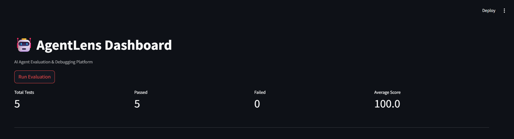
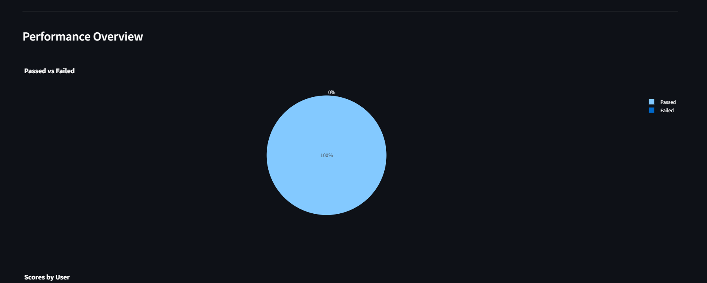
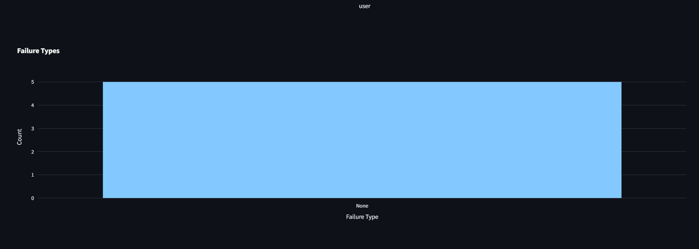
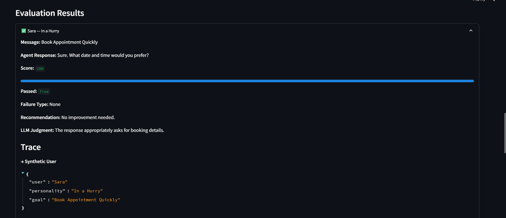

# AgentLens

**Test. Trace. Improve AI Agents before Production.**

## Overview

AgentLens is an AI agent evaluation platform that simulates synthetic users, evaluates agent responses, classifies failures, generates recommendations, and traces the evaluation flow.

## Features

- Synthetic user generation
- Agent response simulation
- Response evaluation
- Failure classification
- Recommendations
- LLM judgment
- Execution tracing
- Metrics and reports
- Interactive Streamlit dashboard
- Filters and CSV export
- Automated unit, API, and integration tests

## Architecture

```text
Synthetic User
      ↓
Booking Agent
      ↓
Evaluation Engine
      ↓
Failure Classifier
      ↓
Recommendation Engine
      ↓
LLM Judgment
      ↓
Trace
      ↓
Metrics & Dashboard
```

## Dashboard Preview

### Evaluation Overview



### Performance Overview



### Failure Analysis



### Evaluation Details & Trace



## Tech Stack

- Python
- FastAPI
- Streamlit
- Pandas
- Plotly
- SQLAlchemy
- SQLite
- Pytest

## Installation

Create a virtual environment:

```bash
python -m venv .venv
```

Activate the virtual environment on Windows:

```bash
.venv\Scripts\activate
```

Install the dependencies:

```bash
pip install -r requirements.txt
```

## Running AgentLens

Start the FastAPI backend:

```bash
uvicorn app.main:app --reload
```

Then, in a second terminal, start the Streamlit dashboard:

```bash
python -m streamlit run agents/dashboard/dashboard.py
```

Open the dashboard in your browser:

```text
http://localhost:8501
```

## Running Tests

Run the automated test suite:

```bash
python -m pytest
```

The test suite includes unit tests, API tests, failure-classification tests, and an integration test covering the complete evaluation flow.

## How It Works

1. AgentLens generates a synthetic user with a personality and goal.
2. The synthetic user interacts with the booking agent.
3. The agent response is evaluated and scored.
4. Failures are classified when detected.
5. AgentLens generates an improvement recommendation.
6. An LLM judgment provides an additional evaluation signal.
7. The full evaluation process is recorded as a trace.
8. Results are visualized in the dashboard and can be exported as CSV.

## Project Status

AgentLens is a working prototype for testing and debugging AI agents before production.